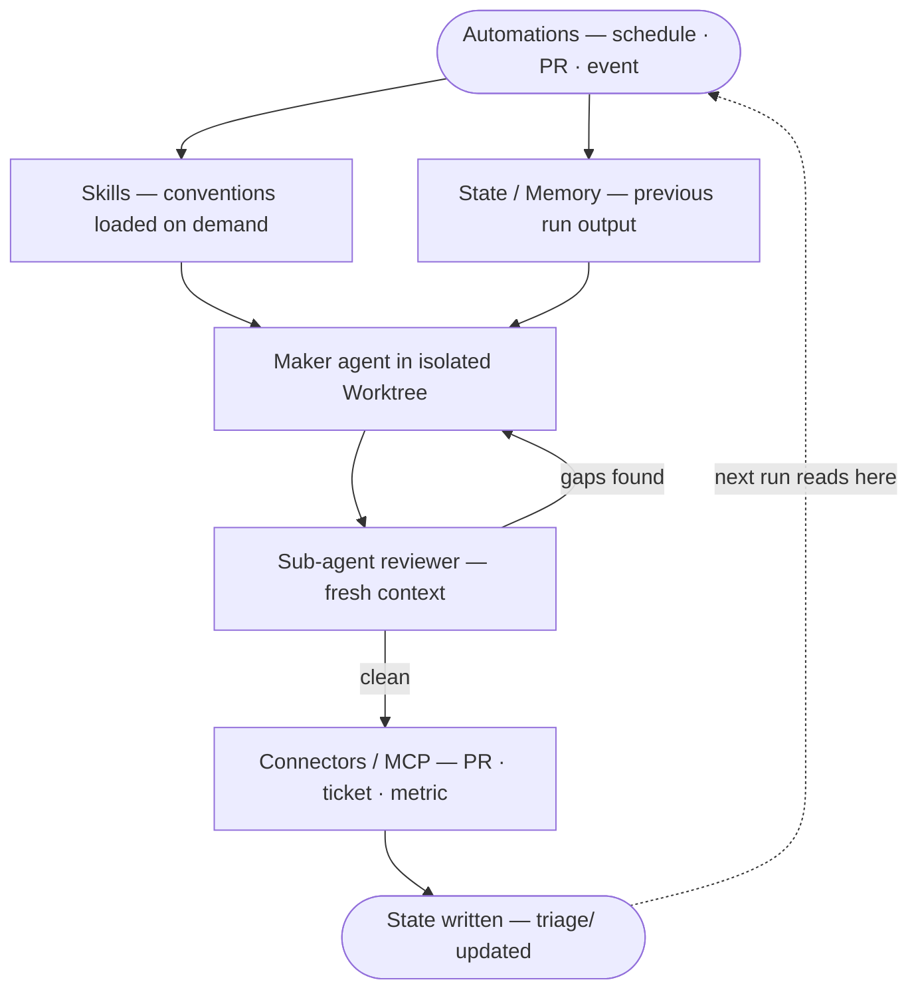
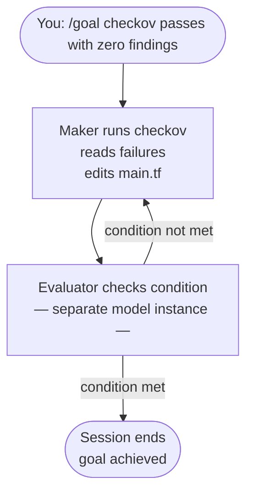
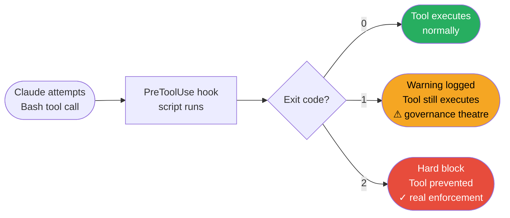
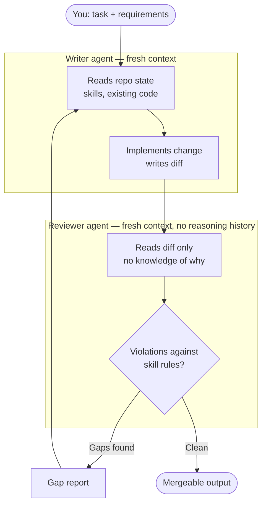
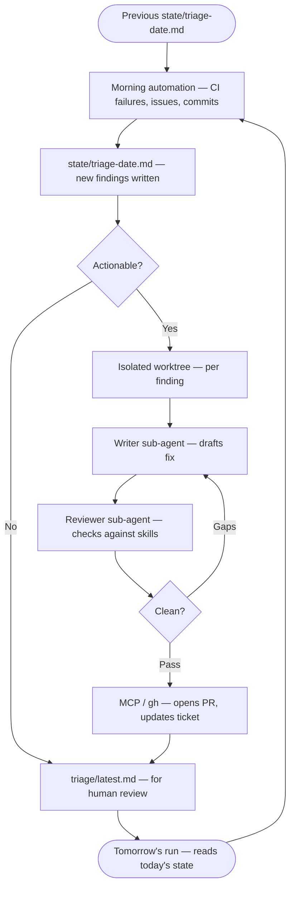

# Loop Engineering for Platform & SRE Engineering
### A learning path: basics → advanced, with governance and observability as defaults

---

## Part 0 — Orientation

**What it is.** Loop engineering is the practice of designing the system that drives an AI agent through a task, rather than prompting it turn by turn yourself. It's the 2026 name for a shift that started with prompt engineering and moved through context engineering and harness engineering:

| Layer | Question it answers | Platform engineering example |
|---|---|---|
| Prompt engineering | What do I say to get a good output? | "Write a Terraform module for an RDS Aurora cluster" |
| Context engineering | What information does the model need to see? | Feeding it your existing modules, tagging standards, VPC layout |
| Harness engineering | What environment does the agent run in, with what tools? | CLAUDE.md, MCP servers, hooks, permission mode, sandboxing |
| **Loop engineering** | What's the cycle that drives it to a *verified* goal, unattended? | Plan → apply → policy check → drift check → repeat until clean |

Each layer wraps the previous one. You still need good prompts and good context — loop engineering is what you add on top so the agent doesn't need you present for every iteration.

**Where the idea comes from.** Peter Steinberger's observation crystallises the shift: agents shouldn't be prompted by humans — you should design loops that prompt them. Boris Cherny (Claude Code lead at Anthropic) describes his own job not as prompting Claude, but as writing the loops that do the prompting. The prior model — one prompt, read response, next prompt — is becoming obsolete for serious platform work. Addy Osmani's June 2026 essay "Loop Engineering" formalises this into a set of primitives that structure the rest of this document.

**Why it matters more in platform/SRE than in app code.** A web app bug is usually reversible. A bad `terraform apply`, a botched Flux reconciliation, or an over-permissive IAM policy can take down production or open a security hole. That means the "verifier" in your loop has to be stricter and more automatic than in general software work, and governance can't be advisory — it has to be a hard gate.

Three failure modes appear only once loops run well: **verification debt** (the loop makes mistakes unattended), **comprehension debt** (the loop ships code you don't understand), and **cognitive surrender** (the loop replaces your judgment rather than acting on it). Part 4.5 covers how to catch all three.

### The six primitives of a loop

Osmani identifies six building blocks that every mature loop draws from:

| Primitive | What it does | Platform/SRE form |
|---|---|---|
| **Automations** | Scheduled or event-triggered runs — the heartbeat | Nightly drift detection, PR policy checks, morning triage |
| **Worktrees** | Isolated working directories so parallel agents don't collide | `git worktree` per agent, `isolation: worktree` on subagents |
| **Skills** | Persistent project knowledge loaded on demand | `terraform-conventions`, `k8s-governance`, `flux-conventions` SKILL.md files |
| **Connectors / MCP** | Live connections to external systems | GitHub PR comments, New Relic events, Port.io entity updates |
| **Sub-agents** | Separate maker from checker | `security-reviewer`, `cost-reviewer`, `sre-verifier` agents |
| **Memory / State** | External persistence across runs — "the spine" | `state/` directory, triage inbox, Linear board |

Without all six in place, a loop is partial: it may run, but it won't hold its governance guarantees across sessions.



### Core vocabulary

Four terms you need before Part 1. Others are defined when they first appear.

- **Verifier** — anything that turns "looks done" into a pass/fail signal: `terraform plan`, `checkov`, `kubeconform`, a Flux `kustomization` diff, a New Relic NRQL threshold.
- **Closed loop** — success criteria pinned in advance, hard checks, explicit stop condition. Predictable, bounded blast radius. Default for infra work.
- **Open loop** — a goal and loose conditions, agent explores broadly. Useful for investigation, risky for anything that mutates infrastructure.
- **Harness** — the environment the agent runs in: CLAUDE.md, skills, MCP servers, hooks, permission mode.

---

## Part 1 — Basics: manual loops, you're the outer verifier

The goal here is to get comfortable with the "give Claude a check it can run" pattern before you automate anything. Every loop at this stage runs inside a single interactive session; you watch it iterate.

### 1.1 Set the harness up correctly from day one

Governance and observability are much easier to make default behaviour if they're wired in before you start using the tool day-to-day, rather than retrofitted. See **Part 5** for the concrete project structure — do that first. Pay particular attention to creating the `state/` directory early: even in manual loops you want a habit of writing evidence somewhere durable, not just reading terminal scrollback.

### 1.2 Exercise: verified Terraform loop

Instead of "write me an Aurora module," give it a check:

> "Write a Terraform module for an RDS Aurora PostgreSQL cluster matching the pattern in `modules/rds/`. After writing it, run `terraform validate`, `tflint`, and `checkov -d .`. Fix any findings and re-run until clean. Show me the final checkov output."

Claude reads the tool output, identifies what failed, edits the file, and re-runs the check — all within the same session, without you re-prompting.

This is the entire pattern: **task → machine-checkable criteria → iterate until pass → show evidence**. Don't accept "should be fine" — insist on the tool output.

### 1.3 Exercise: Kubernetes manifest loop

> "Update the HPA for `checkout-service` (`clusters/prod/apps/checkout-service/hpa.yaml`) to scale on a custom external metric using KEDA's `ScaledObject` instead of a standard CPU-based HPA. Use a `prometheus` trigger as a placeholder (metric: `http_requests_per_second`, threshold: 100). After each change, run `kubeconform -strict -ignore-missing-schemas -summary clusters/prod/apps/checkout-service/` and `kube-linter lint clusters/prod/apps/checkout-service/`. Iterate until both pass with zero findings. Show me the final output of both tools."

Note: the original exercise references New Relic metrics. If New Relic is not yet connected, use a `prometheus` KEDA trigger as a structural placeholder — the loop pattern is identical. When New Relic is wired in, swap the trigger type to `newrelic`; the `ScaledObject` structure stays the same.

### 1.4 Exercise: FluxCD reconciliation loop

> "I've changed the `checkout-service` Kustomization. Run `flux diff kustomization checkout-service --path ./clusters/prod` and treat any unexpected resource deletions or prod-namespace changes as a failure. Explain the diff before I approve it."

### 1.5 Use plan mode as your default posture

For anything beyond a one-line fix, use the four-phase workflow: **explore → plan → implement → commit**. Enter plan mode (`Shift+Tab` until `⏸ plan mode on`), let Claude read the Terraform state, Flux kustomizations, or cluster config *without* making changes, then have it write a plan you can edit before anything touches infrastructure. For infra work, skipping straight to changes is the single riskiest habit to avoid.

---

## Part 2 — Intermediate: session-level loops that close without you

Now you start letting the loop run further before you have to intervene, using structural features instead of babysitting the conversation.

### 2.1 `/goal` — a standing condition with a separate checker

Two loop primitives, different triggers:
- `/goal` — condition-based: runs until a verifiable state is reached. Use for "fix until clean", "implement until tests pass", clearing a backlog.
- `/loop` — cadence-based: re-runs on a time interval regardless of progress. Use for scheduled drift detection, recurring triage, monitoring checks.

This section covers `/goal`. Apply it deliberately for infra work: the model that wrote the Terraform is too forgiving when reviewing its own plan. The separate evaluator is what makes the goal honest.

Set a completion condition once with `/goal <condition>` and Claude works toward it autonomously — after every turn, a separate small model evaluates whether the condition holds. If not met, Claude starts another turn without you re-prompting. The session ends when: condition is met, deemed impossible, or an unrecoverable error occurs.

```
/goal terraform validate and checkov -d terraform/modules/rds/ both pass with zero findings
```

The critical design: the evaluator is a *different model instance* from the one doing the work. The maker doesn't grade its own homework. This is what makes `/goal` more robust than asking Claude to "keep going until it looks right" — Claude's own judgment is not the stop condition.



> [!NOTE]
> **Observed in practice:** Two checkov checks were deliberately removed from `terraform/modules/rds/main.tf` (CKV_AWS_313 — copy tags to snapshots, CKV_AWS_162 — IAM authentication). Claude ran checkov, identified both failures by check ID, restored the missing lines, re-ran, and the evaluator confirmed clean. One loop iteration, zero re-prompts. The evaluator's job was purely mechanical: did checkov exit 0 with zero findings? It didn't need to understand the code.

### 2.2 Hooks — governance that can't be skipped

This is where "governance by default" stops being a CLAUDE.md suggestion and becomes enforcement. A **PreToolUse hook** runs your check as a script and blocks a tool from executing unless the check passes. Examples worth building early:

- Block `terraform apply` if the command targets `env=prod` without a ticket reference in the commit message or `TICKET` env var.
- Block `kubectl apply` to `clusters/prod/` unless a `checkov`/OPA policy pass has run in the current session.
- Run a secret scanner (gitleaks) before any `git commit`.

Hooks are deterministic; CLAUDE.md instructions are advisory. Put anything that must never be skipped into a hook, not a CLAUDE.md line.

**Hook exit codes matter:** In Claude Code's hook system, `exit 1` is a *non-blocking warning* — the error is logged but the tool still runs. Use `exit 2` for a hard block that prevents the tool from executing. A hook that exits 1 when it should exit 2 is governance theatre: the error fires, the command proceeds.



> [!NOTE]
> **Observed in practice:** The hook was initially written with `exit 1` throughout. When triggered, Claude Code reported "Failed with **non-blocking** status code" — the error fired, but `kubectl apply` ran anyway. Changing to `exit 2` produced "PreToolUse:Bash hook error" and the tool was fully blocked. The hook wording in the error message was identical in both cases. The only observable difference was whether the command actually executed. `exit 1` is not enforcement; it is a log entry.

### 2.3 Sub-agent verification — the writer/reviewer pattern

Have one session implement, and a fresh sub-agent (or a second session) review the diff against your requirements with no knowledge of the reasoning that produced it:

> "Use a sub-agent to review the Karpenter NodePool changes against our cost-governance skill. Check instance-type constraints, consolidation policy, and that no `spot`-only pool serves the payments namespace. Report gaps only, not style preferences."

This matters more in infra than app code: a model grading its own Terraform plan will usually approve it. Three-agent splits are common in mature loops: one explores, one implements, one verifies against spec.

Sub-agents burn more tokens; use them where a second opinion is worth the cost — security, cost, and SRE compliance checks are the right places.



> [!NOTE]
> **Observed in practice:** The writer added an SQS trigger to the checkout-service ScaledObject alongside a prometheus trigger. The reviewer sub-agent — with no knowledge of the implementation — found all 8 required label keys missing across the manifest. The labels present were informal shorthand (`app`, `team`, `env`, `managed-by`); the skill requires `app.kubernetes.io/name`, `app.kubernetes.io/version`, `platform.io/team`, `platform.io/cost-centre`, etc. The writer knew the labels were shorthand and implicitly accepted them. The reviewer just compared the file against the rule and flagged every mismatch.
>
> One further finding: the SQS trigger used `queueLength: "50"` as its threshold field — a different key name from the prometheus `threshold: "100"`. The reviewer **correctly accepted** this as compliant, judging from the rule alone ("every trigger has an explicit numeric threshold") that `queueLength` satisfied the intent. Fresh context doesn't mean no judgment — it means no inherited assumptions from the writer's reasoning.

### 2.4 Build governance and observability *as skills*, not one-off prompts

Anything you'd otherwise repeat as an instruction belongs in a skill. This is also the cure for **intent debt**: without skills, every loop run re-derives your conventions from scratch — producing inconsistent output and wasting tokens on context you've already established.

Skills are a folder containing `SKILL.md` (not a single flat file). They are loaded on demand, not on every session. Key skills for platform work:

- `terraform-conventions` — your tagging schema, module layout, state backend rules, mandatory `checkov`/OPA policies.
- `k8s-governance` — required labels, PodDisruptionBudget rules, namespace network policy defaults, Istio mTLS requirements.
- `observability-standards` — what every new service must ship with (New Relic APM config, SLO dashboard, alert routing), and the NRQL patterns you use for golden signals.
- `flux-conventions` — how Kustomizations are structured, promotion flow between clusters, required health checks.

Think of skills as "intent written down on the outside" — decisions that have already been made, so the loop doesn't need to remake them each run.

> [!NOTE]
> **Observed in practice:** Loading `$terraform-conventions` against the RDS module found that `var.common_tags` had no validation block — only a description saying "must include: env, team, cost-centre, ticket, managed-by." The description is documentation. It has no effect at plan time. A caller passing `common_tags = {}` would produce untagged resources that only fail checkov after apply. Adding a `validation` block with `alltrue([for k in [...] : contains(keys(var.common_tags), k)])` surfaces the error at `terraform plan` — before a single resource is touched. The pattern: description is advisory, validation is enforcement. Same principle as CLAUDE.md vs hooks.

### 2.5 State: memory across runs

The model forgets between sessions; the repo doesn't. For anything that runs more than once — a triage automation, a recurring drift check — you need external state: a markdown file the loop writes to, a Linear board updated via MCP, or a `state/` directory checked into the repo (with run outputs, not gitignored). Without it, each morning the loop starts completely blind.

A concrete pattern: after every automation run, write a findings file to `state/triage-<date>.md`. The next run reads the previous file before generating new findings. The triage inbox (`triage/`) surfaces unresolved items for human review. This is what Osmani calls "the spine of the whole thing."

> [!NOTE]
> **Observed in practice:** Running `morning-triage.sh` produced no findings file — the `claude -p` call ran silently and the script reported "findings file was not produced." Root cause: `gh run list` and `flux get kustomizations` require external connections (GitHub CLI auth, live cluster kubeconfig) that weren't available. The script handled it gracefully without crashing, but the triage inbox was not updated. In a real CI environment with OIDC auth and a cluster kubeconfig wired in, all four checks populate automatically. The state pattern itself is sound; the tools it depends on need to be connected first.
>
> A second finding emerged in 3.4: an actionable item in the triage file read "Labels updated to app.kubernetes.io/* schema" — omitting the `platform.io/*` half of the required label set. The adversarial reviewer flagged this as a k8s-governance violation. The code was correct; the wording was ambiguous enough that an engineer actioning it might implement only half. Triage output that reaches humans needs to be as precise as code — underspecified instructions are a gap in the handoff.

---

## Part 3 — Advanced: unattended and scheduled loops

This is where loop engineering earns its name properly: loops that run without an interactive session open.

### 3.1 Non-interactive mode in CI

`claude -p "prompt" --output-format json` runs headless — this is how loops live in GitHub Actions rather than your terminal. Example: a PR-triggered loop that runs `terraform plan`, cost-estimates the diff, checks policy compliance, and posts a structured comment — all before a human reviews it.

```bash
claude -p "Run terraform plan for the changed modules in this PR. Summarise the diff,
flag any resource without required tags, estimate cost delta using AWS Pricing MCP,
and post the summary as a PR comment via gh." \
  --allowedTools "Bash(terraform *),Bash(gh pr comment *)" \
  --output-format json
```

Scope `--allowedTools` tightly for anything running unattended against real infrastructure — this is your single most important safety control at this stage. Expanding the allowlist should require the same review as expanding IAM permissions.

Write loop output to `state/` before the session ends. Terminal scrollback that disappears when the session closes is not an audit trail.

> [!NOTE]
> **Observed in practice:** Reading `pr-policy-check.sh` and `drift-detection.yml` together makes the safety model concrete. The workflow uses OIDC (`id-token: write`) to assume a short-lived IAM role — no long-lived AWS keys stored as secrets. The `--allowedTools` list in the script is then the second layer: even with valid AWS credentials, the loop can only run `terraform *`, `checkov *`, `opa eval *`, and `gh pr comment *`. It cannot `kubectl apply`, `terraform apply`, or write outside `state/`. The prompt saying "do not apply" is advisory. The allowlist is what actually prevents it. Both layers are necessary — credentials scoped to least privilege, tools scoped to the operation.

### 3.2 Scheduled loops — the heartbeat

Recurring checks that run on a timer rather than a trigger: nightly EKS deprecated-API scans ahead of upgrades, Karpenter drift detection, Aurora backup/failover verification, Cloudflare WAF rule drift against your baseline, morning triage across CI and open issues. Treat these exactly like the CI loop above but fired by a schedule instead of a PR event.

The important discipline is the same: bounded scope, explicit stop condition, evidence written to `state/` and surfaced to `triage/` when action is needed. The triage inbox (`triage/latest.md`, `triage/drift-latest.json`) is the handoff point between the loop and the human.

A concrete end-to-end example of a loop day:

1. Morning automation reads CI failures, open issues, recent commits → writes `state/triage-<date>.md`.
2. Each actionable finding gets an isolated worktree + a sub-agent to draft a fix.
3. A second sub-agent reviews the draft against project skills and existing tests.
4. Connectors (MCP/`gh`) open the PR and update the ticket.
5. Unresolved items land in `triage/` for human review.
6. State file persists progress so tomorrow's run picks up where today's stopped.

Designed once, runs without manual prompting at each step.

> [!NOTE]
> **Observed in practice:** Reading `drift-detection.sh`, the `--allowedTools` line was `"Bash(kubectl *),Bash(aws rds *)"` — too permissive. `kubectl *` permits `kubectl delete` and `kubectl apply`; `aws rds *` permits `aws rds delete-db-cluster`. The loop is read-only by design, but the allowlist didn't enforce that. Tightened to `"Bash(kubectl get *),Bash(aws rds describe-db-clusters *),Bash(aws rds describe-db-instances *)"` — specific read commands only. The principle: the prompt describes intent, the allowlist enforces it. A loop that can only `describe` cannot accidentally `delete`, regardless of what the model decides to do.



### 3.3 Fan-out for migrations

For large, mechanical changes across many files or clusters — Cilium migration off VPC CNI, Istio ambient rollout, EKS Auto Mode cutover — fan out instead of doing it in one long session:

1. Have Claude generate the task list (every affected manifest, module, or cluster) into a file.
2. Loop `claude -p` over the list, one invocation per unit of work, each scoped with `--allowedTools`.
3. Test on 2–3 items, refine the prompt, then run the full set.

> [!IMPORTANT]
> **Ralph technique** (named by Geoffrey Huntley, early 2026): each iteration is a fresh agent reading current repo state from disk rather than one long session accumulating context. For a multi-week mesh migration, fresh-context-per-unit beats one degrading session every time.

Worktrees prevent mechanical file collisions between parallel agents, but note: worktrees remove the collision problem, not the review bandwidth problem. Human review of what the loop produced remains the real ceiling.

> [!NOTE]
> **Observed in practice:** Running Step 1 of the fan-out pattern — grepping `clusters/prod/` for manifests still using the old informal label schema — returned empty. The checkout-service manifests had already been updated in exercise 2.3. The task list was empty; Step 2 correctly ran zero invocations. This is the correct outcome: generating the task list first and finding nothing to do is a valid result, not a failure. In a real migration with 40–50 services, the same grep would return the full list and the while loop fans out automatically. The pattern is identical regardless of scale.

### 3.4 Adversarial review as a standing gate

Before any unattended loop's output is treated as mergeable, run a review sub-agent against the diff in a fresh context, checking it against your plan/spec and governance skills — not asking "is this good code" but "does this violate a named rule." This is the practice that keeps autonomous loops from quietly drifting out of policy.

> [!NOTE]
> **Observed in practice:** A reviewer sub-agent checked `state/triage-2026-09-17.md` against `terraform-conventions` and `k8s-governance` and found one violation: actionable item 3 read "Labels updated to app.kubernetes.io/* schema" — which omits the `platform.io/*` half of the required label set. The code was correct. The wording was ambiguous enough that an engineer actioning the finding might implement only half. The reviewer had no knowledge of what was actually done — it read the instruction literally and checked it against the rule. The fix was tightening the triage output wording to name both label namespaces explicitly. Loops that generate instructions for humans are subject to the same precision standard as code.

### 3.5 Parallel sessions / worktrees for coordinated infra work

For genuinely parallel work (e.g., updating Terraform modules in one worktree while another session validates the Flux promotion path), isolated git worktrees prevent collisions. Treat this as an optimisation once single-loop patterns are solid — it adds coordination overhead you don't need for Parts 1–2.

> [!NOTE]
> **Observed in practice:** Not exercised directly — worktrees are an optimisation for work that genuinely parallelises. The key caveat from 3.3 applies here too: worktrees remove the collision problem, not the review bandwidth problem. If you fan out 10 agents into 10 worktrees and all finish in 5 minutes, you still have 10 diffs to review. The ceiling is your attention, not the loop's speed. Add worktrees when parallelism is the bottleneck, not as a default.

---

## Part 4 — Governance & observability as defaults (cross-cutting, not a phase)

Bake these in from Part 1 onward rather than bolting them on later.

### 4.1 Enforcement lives in hooks, not instructions

CLAUDE.md tells Claude what's expected. Hooks guarantee it. Any rule where "the agent forgot" is unacceptable — no prod writes without a ticket reference, no secrets committed, no untagged resources — is a hook, full stop.

### 4.2 Default to read-only, escalate explicitly

Start infra-mutating sessions in plan mode or with a tight `--allowedTools` allowlist. Treat `apply`/`kubectl apply`/`flux reconcile --with-source` as commands that need explicit, scoped permission rather than blanket trust — this is your blast-radius control.

### 4.3 Auditability moves from code to trajectory

With a human writing every change, the git history is the audit trail. With agentic loops, the *run* is the audit trail — the plan output, the checkov results, the reviewer's findings. Have every governance-relevant loop write its evidence to `state/` (a named, timestamped file) rather than letting it live only in terminal scrollback that's gone when the session ends.

The `triage/` inbox is the handoff: loop runs write their unresolved findings there; humans review and clear before the next scheduled run. If triage accumulates without being read, your loops are generating noise, not value.

### 4.4 Human checkpoints survive automation

Even in a fully scheduled or CI-triggered loop, keep an explicit approval gate before anything touches production — the "external verifier" (a human) reviewing evidence is faster than re-running the checks yourself, and it's the one thing that catches "technically passed every check, still a bad idea."

### 4.5 What loops don't solve — and what to do about it

Osmani's post is direct on three failure modes that appear only once loops run well:

**Verification debt.** A loop running unattended is also making mistakes unattended. The sub-agent verifier and Stop hooks address this mechanically, but "done" in a loop output is still a claim, not a proof. The weekly loop review (reading `state/` output) is the non-mechanical layer.

**Comprehension debt.** The faster a loop ships code you didn't write, the wider the gap between what exists and what you understand. Smooth loops accelerate this gap unless you actively read the output. Treat `state/` as required reading, not an archive. Schedule time to review what the loop produced — not to approve it retroactively, but to keep your mental model current.

**Cognitive surrender.** When a loop runs itself, there's temptation to stop forming opinions and simply accept its output. Designing a loop with genuine judgment (hard stop conditions, adversarial review, tight allowlists) is the cure. Designing it to avoid thinking is the accelerant. Same tooling, opposite result.

Two engineers can build the identical loop and get opposite outcomes — one moves faster on work they deeply understand; the other uses it to avoid understanding entirely. The loop can't tell the difference. That's what makes loop design harder than prompt engineering, not easier.

### 4.6 Observability of the loops themselves

Once you have several scheduled/CI loops running, monitor *them*: how often does the drift-detection loop find something, how often does the reviewer sub-agent flag a real issue vs. noise, how often does a Stop hook block a turn. This tells you whether your governance rules are well-calibrated or just generating noise nobody reads.

Key signals to track per loop:

| Loop | Signal | Alert condition |
|------|--------|-----------------|
| Drift detection | Exit code / verdict | DRIFT_DETECTED on 2+ consecutive runs without a triage ticket |
| Morning triage | Actionable item count | > 10 unresolved in `triage/` after 48h |
| PR policy check | FAIL rate | > 30% over 7 days (signals miscalibrated rule or workflow) |
| Stop hooks | Block count per session | 5+ fires approaching the 8-block override limit |
| `sre-verifier` | BLOCKED ratio | > 50% sustained → checklist is miscalibrated |

---

## Part 5 — Recommended project structure

```
platform-loops/
├── CLAUDE.md                       # short, human-readable, project-wide rules only
├── .mcp.json                       # MCP server config: aws-documentation, terraform (no secrets)
├── .gitignore                      # Terraform artefacts, state/ contents, sentinel file
├── .claude/
│   ├── settings.json                # hooks, permissions, sandbox config
│   ├── settings.local.json          # personal overrides, gitignored
│   ├── skills/
│   │   ├── terraform-conventions/SKILL.md
│   │   ├── k8s-governance/SKILL.md
│   │   ├── flux-conventions/SKILL.md
│   │   ├── observability-standards/SKILL.md
│   │   ├── cost-governance/SKILL.md
│   │   └── incident-runbook/SKILL.md
│   ├── agents/
│   │   ├── security-reviewer.md      # sub-agent: IAM, secrets, injection
│   │   ├── cost-reviewer.md          # sub-agent: instance types, over-provisioning
│   │   └── sre-verifier.md           # sub-agent: SLO/alerting coverage check
│   └── hooks/
│       ├── block-prod-without-ticket.sh
│       ├── secret-scan-pre-commit.sh
│       └── require-policy-pass.sh
├── terraform/                      # all Terraform code
│   ├── modules/                     # reusable modules — never call directly, use environments/
│   │   ├── vpc/                     # VPC, subnets, IGW, NAT GW, route tables
│   │   ├── eks/                     # EKS cluster, IRSA OIDC, node group
│   │   ├── rds/                     # Aurora PostgreSQL cluster + instances
│   │   ├── iam-role/                # reusable role + policy attachment
│   │   └── karpenter/               # controller IRSA role, node IAM role, instance profile
│   └── environments/                # root modules — one per AWS environment
│       ├── prod/
│       ├── staging/
│       └── dev/
├── clusters/                       # FluxCD Kustomizations and HelmReleases
│   ├── base/                        # shared manifests (namespaces etc.)
│   ├── prod/
│   │   ├── flux-system/gotk-sync.yaml
│   │   ├── apps/                        # application Kustomizations
│   │   └── infra/                       # TODO: Karpenter, cert-manager, KEDA — see Open gaps
│   ├── staging/
│   └── dev/
├── policies/
│   └── platform.rego               # OPA policy: enforce all 6 required tags on every resource
├── loops/                          # automation entry points — the heartbeat
│   ├── morning-triage.sh            # reads CI/issues/Flux → writes state/ and triage/
│   ├── pr-policy-check.sh           # CI-triggered: plan + checkov + OPA + PR comment
│   └── drift-detection.sh           # nightly: EKS, Aurora, WAF drift → triage/ if found
├── .github/
│   └── workflows/
│       ├── pr-policy-check.yml      # triggers loops/pr-policy-check.sh on PR
│       └── drift-detection.yml      # runs loops/drift-detection.sh nightly at 02:00 UTC
├── state/                          # durable run output — the audit trail (contents gitignored)
│   └── waf-baseline.json            # Cloudflare WAF ruleset baseline for drift comparison
├── triage/                         # unresolved findings inbox — reviewed before next run
└── docs/
    ├── governance.md                 # the actual rules, referenced (not pasted) from skills
    └── observability-standards.md
```

**Structure notes:**

- Each skill is a **folder containing `SKILL.md`** (not a single top-level `SKILLS.md`), so Claude loads only the relevant one on demand instead of bloating every session. This is what prevents intent debt at scale.
- `loops/` scripts each use `claude -p` with a scoped `--allowedTools` list. Never expand that list without deliberate review — it's your blast-radius control for unattended runs.
- `state/` is the loop's external memory. Files are timestamped and never deleted — they are the audit record for run trajectories. If a check "technically passed every check, still a bad idea," `state/` is where you go to understand why.
- `triage/` is the handoff between the loop and the human. Loop runs overwrite `triage/latest.md` or `triage/drift-latest.json` with unresolved findings. Review and clear before each scheduled run — silent accumulation means the loops have stopped being useful.
- Keep CLAUDE.md to things that apply on *every* session (bash commands, non-obvious repo conventions). Governance rules belong in skills. Loop entry points belong in `loops/`. None of these belong pasted into CLAUDE.md.
- `/init` will generate a starting CLAUDE.md from your repo structure; refine it down rather than up.

---

## Part 6 — MCP servers worth connecting

Verify current package names/URLs before installing — this list changes fast; use `claude mcp add` with the maintainer's current install instructions.

| Tool | What an MCP connection unlocks |
|---|---|
| **Cloudflare** | Official remote MCP server — DNS, Workers, R2, Zero Trust, WAF config read/write, via `claude mcp add --transport http` |
| **GitHub** | PR/issue read-write, Actions status, review comments — official GitHub MCP server |
| **AWS** | AWS Labs maintain several purpose-built servers (CDK guidance, Cost Explorer/pricing, CloudTrail querying for audit loops) rather than one general server — pick the ones matching your loop's job |
| **Kubernetes** | Several community servers (Go and TypeScript implementations) for cluster read/write; scope RBAC tightly for anything you connect to a prod cluster |
| **Terraform** | HashiCorp-adjacent MCP servers exist for plan/state interaction; for now the CLI (`terraform` via Bash) is the most reliable path and is what the exercises above assume |
| **New Relic** | Query NRQL, pull dashboards/alerts directly into a loop's verification step instead of screen-scraping; emit loop health events via the Events API |
| **Port.io** | Given your existing Port + GitHub Actions self-service work, an MCP connection lets loops read/update Port entities directly as part of a workflow |
| **Linear** | Update issues, create triage tickets, read open work — useful as the state layer for loops that need to track multi-run progress without writing files |

For anything without a mature MCP server yet, the CLI-tool pattern (`gh`, `aws`, `flux`, `kubectl`) works just as well and is often more reliable for scripted loops.

---

## Part 7 — Practice roadmap

**Stage 1 (basics, ~1–2 weeks):** Closed-loop `terraform plan` + `checkov` verifier for one existing module. Get comfortable with plan mode and "show evidence, don't assert success." Create `state/` early and write every loop's output there by habit.

**Stage 2 (intermediate, ~2–3 weeks):** Add a Stop hook that blocks any commit touching `clusters/prod/` without a policy pass. Build the `terraform-conventions` and `k8s-governance` skills — this is where you start paying down intent debt rather than accumulating it. Set up a writer/reviewer sub-agent pair for a real Karpenter NodePool change. Wire `/goal` with its separate checker model.

**Stage 3 (advanced, ~1 month):** Ship all three loop scripts from `loops/` — morning triage, PR policy check, nightly drift detection — running in CI/cron with tightly scoped `--allowedTools`. This is your first genuinely unattended loop. Treat the allowlist scoping and the `state/` audit trail as the hard parts, not the prompt. At the end of each week, spend 15 minutes reading `state/` output to close comprehension debt before it widens.

**Stage 4 (advanced, ongoing):** Apply fan-out + adversarial review to one of your live migrations — Cilium replacing VPC CNI/Istio, or the EKS Auto Mode cutover. Fresh-context-per-unit (Ralph-style) across the affected clusters, reviewer sub-agent gating each PR, human approval gate before any cluster actually cuts over. Watch for cognitive surrender: the loop should be acting on your architectural intent, not replacing it.

---

## Further reading

- Addy Osmani, *Loop Engineering* (June 2026) — the primary source for the six-primitive framework and the three failure modes (verification debt, comprehension debt, cognitive surrender)
- Anthropic, *Best practices for Claude Code* — code.claude.com/docs/en/best-practices
- Anthropic, *Extend Claude Code: skills, hooks, MCP, sub-agents, and plugins* — code.claude.com/docs/en/features-overview
- IBM, *What Is Loop Engineering?* — ibm.com/think/topics/loop-engineering
- Peter Steinberger, *Just Talk To It* / *Shipping at Inference-Speed* — on designing loops rather than prompting agents
- Geoffrey Huntley on the "Ralph" technique (early 2026)
- Cloudflare Agents docs, *Cloudflare's own MCP servers* — developers.cloudflare.com/agents/model-context-protocol/cloudflare

---

## Open gaps — require external wiring before they close

These items were identified during a full review of `platform-loops/` against the practices in this document. They were not auto-fixed because each depends on credentials or live infrastructure that must be connected first.

### WAF drift check uses the wrong Wrangler command

`loops/drift-detection.sh` checks for Cloudflare WAF drift using `wrangler pages deployment list`, which lists Cloudflare Pages deployments — not WAF rulesets. Actual WAF rule drift requires the Cloudflare API (`GET /zones/:zone_id/firewall/rules` or the equivalent `wrangler waf-rules list` command) and a zone ID.

**To close:** Wire Cloudflare credentials (`CLOUDFLARE_API_TOKEN`, `CLOUDFLARE_ZONE_ID`) into the `drift-detection.yml` workflow as repository secrets. Replace the `wrangler pages deployment list` check in `drift-detection.sh` with a Cloudflare API call that reads the current WAF ruleset and diffs it against `state/waf-baseline.json`.

### Loop health observability (Part 4.6) has no implementation

Part 4.6 defines the signals that tell you whether your governance rules are well-calibrated or generating noise: drift detection exit codes, morning triage actionable item count, PR policy check FAIL rate, Stop hook block count, and `sre-verifier` BLOCKED ratio. None of these are currently emitted, stored, or alerted on.

**To close:** Wire a New Relic account and emit a custom event from each loop script after it runs:

```bash
curl -s -X POST "https://insights-collector.newrelic.com/v1/accounts/${NR_ACCOUNT_ID}/events" \
  -H "X-Insert-Key: ${NR_INSERT_KEY}" \
  -H "Content-Type: application/json" \
  -d "[{\"eventType\":\"LoopRun\",\"loop\":\"drift-detection\",\"verdict\":\"${VERDICT}\",\"timestamp\":$(date +%s)}]"
```

Then build a New Relic dashboard querying `FROM LoopRun` with the alert thresholds from the table in Part 4.6. Add `NR_ACCOUNT_ID` and `NR_INSERT_KEY` as repository secrets and pass them to each workflow that invokes a loop script.

### `clusters/` missing `infra/` layer

`flux-conventions` defines a `clusters/<env>/infra/` path alongside `apps/` for infrastructure components — Karpenter controllers, cert-manager, external-secrets-operator, KEDA, etc. Only `apps/` and `flux-system/` exist per cluster. Without the `infra/` layer, these components are either installed out-of-band (no GitOps, no drift detection) or not installed at all.

**To close:** Create `clusters/prod/infra/`, `clusters/staging/infra/`, and `clusters/dev/infra/` directories. Add a Flux `Kustomization` CR pointing at each in the relevant `gotk-sync.yaml`. Populate with `HelmRelease` manifests for each infrastructure component, pinned to specific chart versions. Add those Deployments to the prod `healthChecks` list in `gotk-sync.yaml`.

### `monitoring/checkout-service/dashboard.json` does not exist

`observability-standards` requires a New Relic dashboard JSON committed to `monitoring/<service>/dashboard.json` and applied via Terraform. The `slo.tf` and `alerts.tf` stubs exist; the dashboard file does not, because it requires a real New Relic account to export a populated dashboard from.

**To close:** Build the dashboard in New Relic with panels for SLO burn rate (1h/6h/24h), golden signals (request rate, error rate, latency p50/p95/p99), pod count, CPU, and memory. Export the JSON via the New Relic API (`GET /v2/dashboards/:id`) or Terraform import. Commit to `monitoring/checkout-service/dashboard.json` and add a `newrelic_one_dashboard` resource to a `dashboard.tf` file in the same directory.
